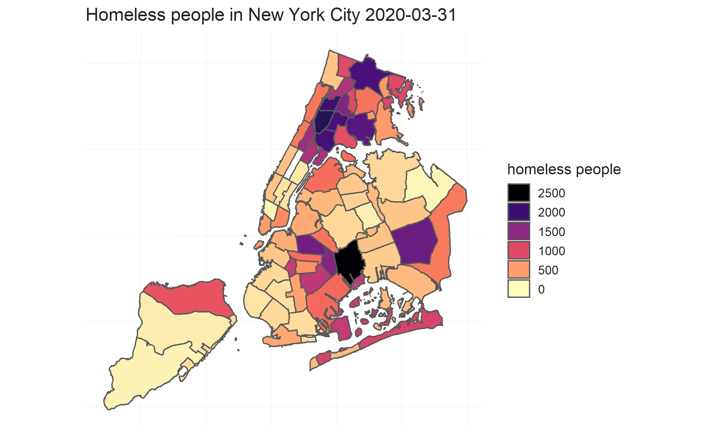
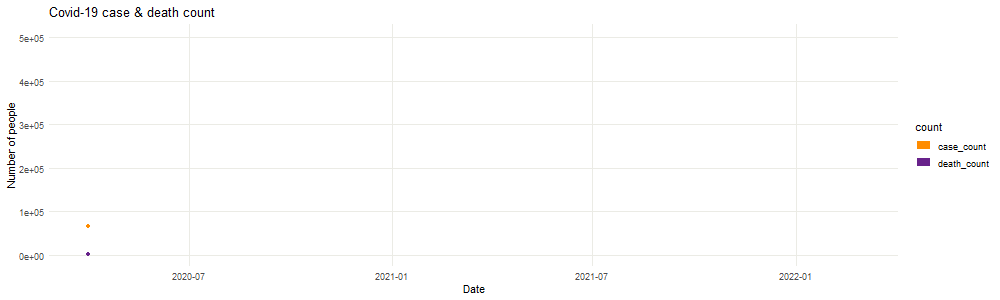

# Project 2: Shiny App Development

### [Project Description](doc/project2_desc.md)

# Project Title： Where you can help during COVID-19
## Homelessness during the pandemic





Term: Spring 2022

+ Team #5
+ **Team members**:
	+ Kurihara, Sarah sqk2003@columbia.edu
	+ Shao, Jiahao js5954@columbia.edu
	+ Wang, Huiying hw2816@columbia.edu
	+ Zheng, Haozhong hz2694@columbia.edu

+ **App link**: [app](https://545089467-shao.shinyapps.io/5243_Project2/) 


+ **Project summary**: We focus on the homelessness of New York during pandenmic from March of 2020 to the end of 2021. We develop this shiny app to illustrate our strategy about how to help homeless people. We provide visualization of statistics about covid and homelessness as well as heatmap of homeless people using 59 [community districts](https://communityprofiles.planning.nyc.gov/) defined by NYC Department of City Planning. We also give our suggestions on how to help these people with visualiztion methods. 

+ **Contribution statement**: ([contribution statement](doc/a_note_on_contributions.md)) Haozhong, Huiying, Jiahao and Sarah desiced the topic of this project. Haozhong cleaned data and developed annimation, front and reference page for the app. Huiying cleaned data and developed the interactive plot with statistics page for the app. Jiahao merged data and developed map and resources page and publish the app. Sarah is the presentor of this project and developed statistics, map and resources page for the app. All team members contributed to the GitHub repository and prepared the presentation. All team members approve our work presented in our GitHub repository including this contribution statement. 

Following [suggestions](http://nicercode.github.io/blog/2013-04-05-projects/) by [RICH FITZJOHN](http://nicercode.github.io/about/#Team) (@richfitz). This folder is orgarnized as follows.

```
proj/
├── app/
├── lib/
├── data/
├── doc/
└── output/
```

Please see each subfolder for a README file.

