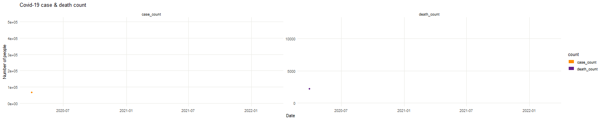

# Project 2: Shiny App Development

### [Project Description](doc/project2_desc.md)

# Project Title： Where you can help during COVID-19
## Homelessness during the pandemic




Term: Spring 2022

+ Team #5
+ **Team members**:
	+ Kurihara, Sarah sqk2003@columbia.edu
	+ Shao, Jiahao js5954@columbia.edu
	+ Wang, Huiying hw2816@columbia.edu
	+ Zheng, Haozhong hz2694@columbia.edu

+ **App link**: [app](https://545089467-shao.shinyapps.io/5243_Project2/) 


+ **Project summary**: We focus on the homelessness of New York during pandenmic from March of 2020 to the end of 2021. We develop this shiny app to illustrate our strategy about how to help homeless people. We provide visualization of statistics about covid and homelessness as well as heatmap of homeless people using 59 [community districts](https://communityprofiles.planning.nyc.gov/) defined by NYC Department of City Planning. We also give our suggestions on how to help these people with visualiztion methods. 

+ **Contribution statement**: ([default](doc/a_note_on_contributions.md)) All team members contributed equally in all stages of this project. All team members approve our work presented in this GitHub repository including this contributions statement. 

Following [suggestions](http://nicercode.github.io/blog/2013-04-05-projects/) by [RICH FITZJOHN](http://nicercode.github.io/about/#Team) (@richfitz). This folder is orgarnized as follows.

```
proj/
├── app/
├── lib/
├── data/
├── doc/
└── output/
```

Please see each subfolder for a README file.

